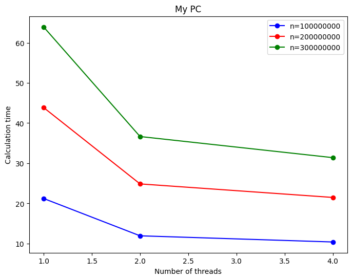

# MergeSortTasks

This program sorts an array using merge sort algorithm with the help of OpenMP tasks.

## Compile and Run

The program can be built using the following commands:

- Build: `make`
- Build and Run: `make run`
- Build and Run with Valgrind: `make valgrind`
- Clean: `make clean`

Command line arguments can be modified in the `Makefile` under the `ARGS` variable.


## Parallelization Strategy

This project focuses on optimizing merge sort through parallelization. The merge sort algorithm has a complexity of $O(n \times logn)$. The associated pseudocode is as follows:


```plaintext
MergeSort(arr[], l, r)
    if l < r
        mid = (l + r) / 2
        
        MergeSort(arr, l, mid)
        MergeSort(arr, mid + 1, r)

        Merge(arr, l, mid, r)

Merge(arr[], l, mid, r)
    n1 = mid - l + 1
    n2 = r - mid
    left[n1], right[n2]

    for i = 0 to n1 - 1
        left[i] = arr[l + i]
    for j = 0 to n2 - 1
        right[j] = arr[mid + 1 + j]

    i = 0
    j = 0
    k = l

    while i < n1 and j < n2
        if left[i] <= right[j]
            arr[k] = left[i]
            i = i + 1
        else
            arr[k] = right[j]
            j = j + 1
        k = k + 1

    while i < n1
        arr[k] = left[i]
        i = i + 1
        k = k + 1

    while j < n2
        arr[k] = right[j]
        j = j + 1
        k = k + 1
```

This project implements the Merge Sort algorithm with parallelization using OpenMP directives. The algorithm recursively divides the array into smaller pieces and classifies them, ultimately merging them to obtain the final sorted array. While the algorithm is inherently iterative, traditional parallelization using #pragma omp for is not suitable due to its recursive nature. Instead, the task directive is employed to create independent tasks that can be executed concurrently.

It is crucial to note that as the number of inputs decreases, the overhead caused by task creation may outweigh the benefits. Therefore, the if statement is modified to control the generation of new tasks, ensuring optimal performance. Additionally, when the input size becomes sufficiently small, the algorithm switches to Selection Sort for efficiency, halting further recursive divisions.


## Results 

Below are the performance results.




## Performance Considerations

- Adjust the number of threads based on the system and matrix dimensions for optimal performance.   